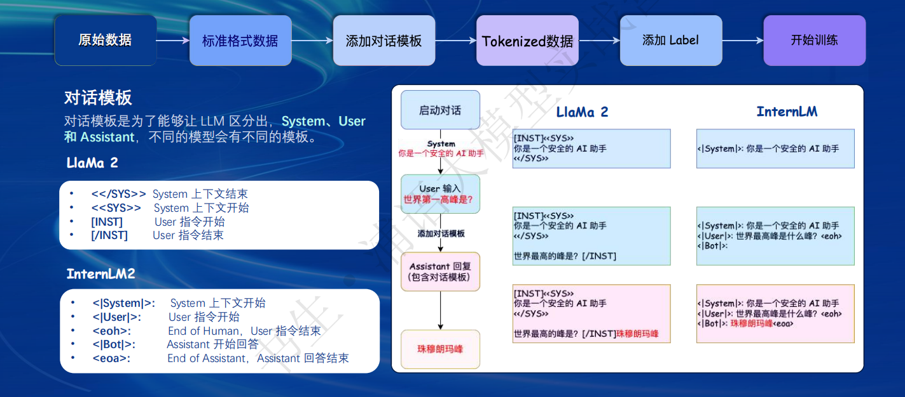
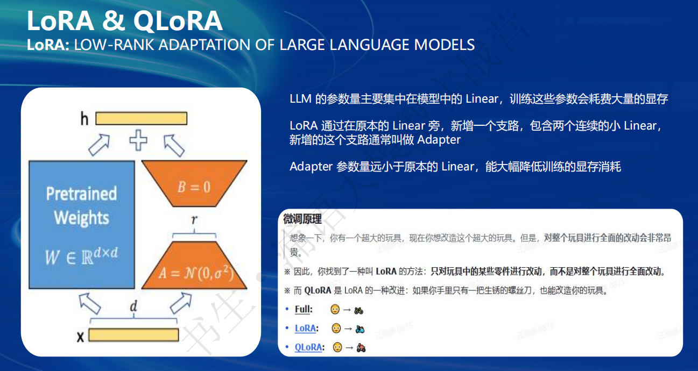
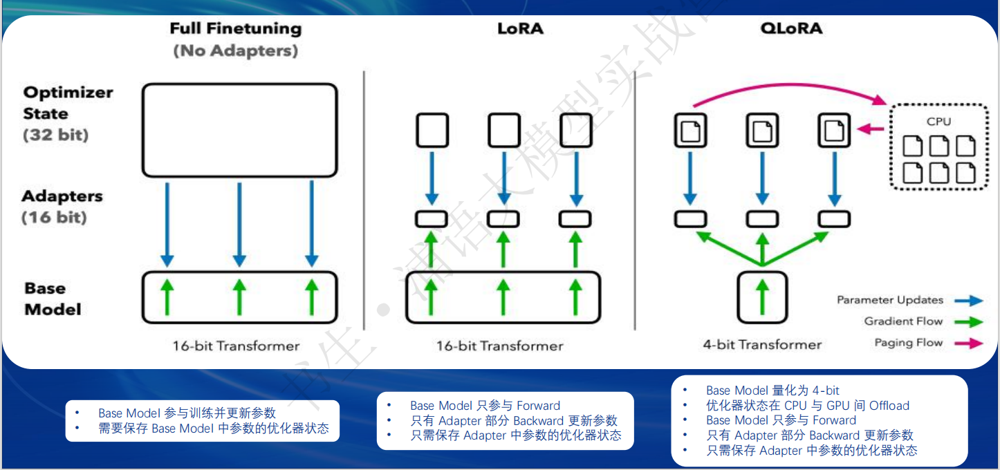
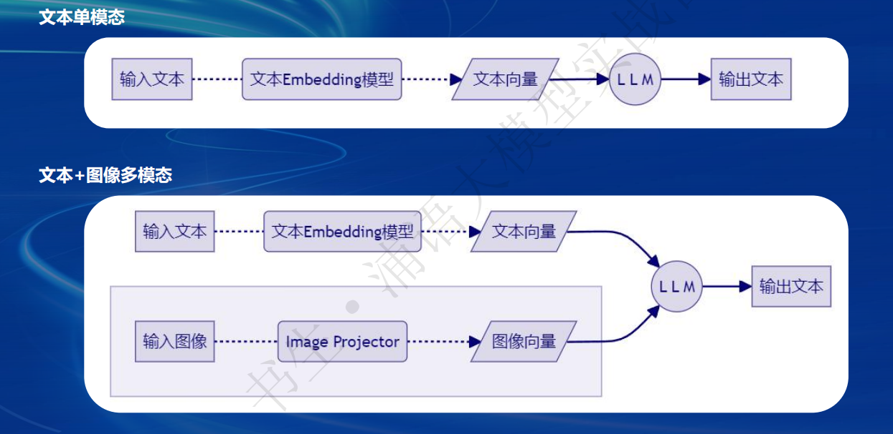

## 1. Finetune简介
### 1.1 两种Finetune范式
1. 增量预训练微调
使用场景：让基座模型学习到新的知识，如某个垂类领域知识
训练数据：文章，书籍，代码等
2. 指令跟随微调
使用场景：让模型学会对话模板，根据人类指令进行对话
训练数据：高质量的对话，问答数据
### 1.1.1 数据处理
数据流程：（原始数据->标准格式数据->添加对话模板->Tokenized数据->添加Label->开始训练）
对话角色：（System， User，Assitant）
对话模板：为了让LLM区分出Systerm，User和Assitant，不同的模型会有不同的模板。

起始符，结束符：为了让LLM知道什么时候开启，什么时候结束一段对话。（通常使用<s></s>）
只对答案部分计算loss：为了让大模型学会答案，而不包括问题。
### 1.1.2 LoRA和QLoRA



## 2. XTuner简介
适配多种生态（多种微调算法（SFT）；适配多种开源生态（HuggingFace，ModelScope等模型，数据集）），最低8G显存就能微调7B模型。
其他框架：LLaMa-Factory
```
1. 安装
pip install xtnuer
2. 挑选配置模板
xtuner list-cfg -p internlm_20b
3. 一键训练
xtnuer train internlm_20b_qlora_oasst1_512_e3
4. 拷贝配置模板
xtuner copy-cfg 
5. Float16模型对话
xtuner chat internlm/internlm-chat-20b
6. 4bit模型对话
xtuner chat internlm/internlm-chat-20b --bits 4
7. 加载Adapter模型对话
xtuner chat internlm/internlm-chat-20b --adapter $model

```
优化技巧：Flash Attention 和 DeepSpeed ZeRO

## 3. 微调实战
1. 准备模型
2. 准备数据
3. 选择配置文件并修改
4. 开始训练
5. 转换为huggingFace格式
6. 合并模型
## 4. 多模态LLM

