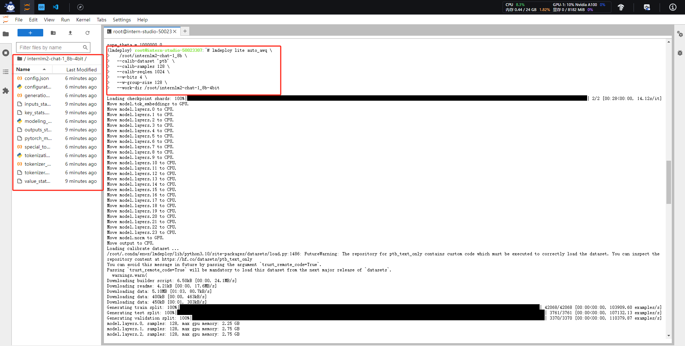
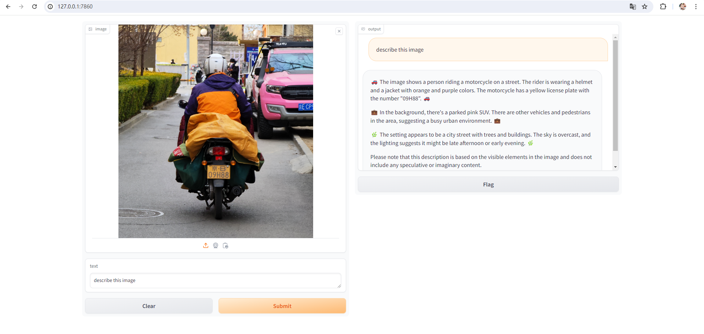

1. 配置 LMDeploy 运行环境 以命令行方式与 InternLM2-Chat-1.8B 模型对话


## 进阶作业

1. 设置KV Cache最大占用比例为0.4，开启W4A16量化，以命令行方式与模型对话。

**量化4bit模型**

**命令行对话**


2. 以API Server方式启动 lmdeploy，开启 W4A16量化，调整KV Cache的占用比例为0.4，分别使用命令行客户端与Gradio网页客户端与模型对话。
**命令行访问4bit模型**

**网页启动4bit服务**

**网页访问4bit服务**


3. 使用W4A16量化，调整KV Cache的占用比例为0.4，使用Python代码集成的方式运行internlm2-chat-1.8b模型。
```
from lmdeploy import pipeline, TurbomindEngineConfig

# 调低 k/v cache内存占比调整为总显存的 20%
backend_config = TurbomindEngineConfig(model_format='awq', cache_max_entry_count=0.4)

pipe = pipeline('/root/internlm2-chat-1_8b-4bit', backend_config=backend_config)

while True:
    shuru = input("请输入：")
    response = pipe([shuru])
    print(response)
```


4. 使用 LMDeploy 运行视觉多模态大模型 llava gradio demo。

