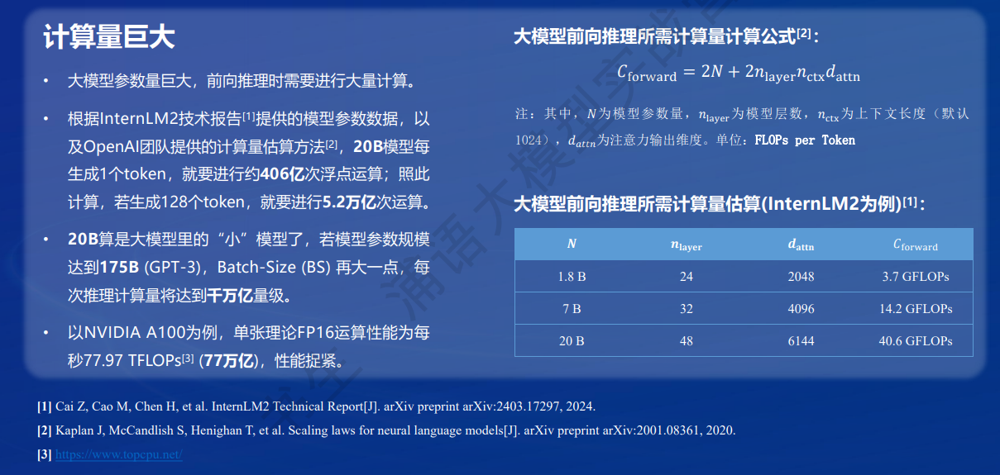
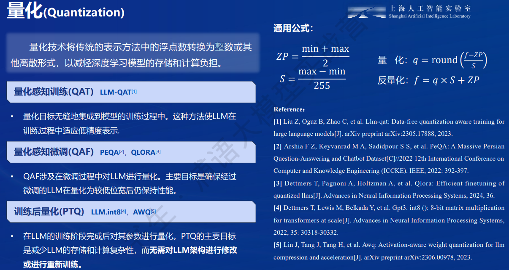

## 1. 模型部署基础
**模型部署概念**

### 1.1 模型部署的挑战
1. 计算量巨大

2. 内存开销巨大

3. 访存瓶颈
4. 动态请求


### 1.2 模型部署方法
1. 模型剪枝

2. 知识蒸馏

3. 量化
量化是一种以参数或计算中间结果精度下降换空间节省（以及同时带来的性能提升）的策略。
**计算密集（compute-bound）**: 指推理过程中，绝大部分时间消耗在数值计算上；针对计算密集型场景，可以通过使用更快的硬件计算单元来提升计算速度。
**访存密集（memory-bound）**: 指推理过程中，绝大部分时间消耗在数据读取上；针对访存密集型场景，一般通过减少访存次数、提高计算访存比或降低访存量来优化。
LLM是典型的访存密集型任务。可使用KV8量化和W4A16量化。
**KV8量化**：是指将逐 Token（Decoding）生成过程中的上下文 K 和 V 中间结果进行 INT8 量化（计算时再反量化），以降低生成过程中的显存占用。
**W4A16 量化**：将 FP16 的模型权重量化为 INT4，Kernel 计算时，访存量直接降为 FP16 模型的 1/4，大幅降低了访存成本。Weight Only 是指仅量化权重，数值计算依然采用 FP16（需要将 INT4 权重反量化）。



## 2. LMDeploy简介
**LMDeploy简介**

**LMDeploy核心功能**


## 3. LMDeploy实操
1. 创建开发机
需要选取Cuda12.2-conda环境，11.7环境可能不兼容。
2. 创建开发环境
```
studio-conda -t lmdeploy -o pytorch-2.1.2
```
3. 安装LMDeploy
```
pip install lmdeploy[all]==0.3.0
```
4. 准备模型
```
ln -s /root/share/new_models/Shanghai_AI_Laboratory/internlm2-chat-1_8b
```
5. 使用Transformer库运行模型
```
import torch
from transformers import AutoTokenizer, AutoModelForCausalLM
import time

tokenizer = AutoTokenizer.from_pretrained("/root/internlm2-chat-1_8b", trust_remote_code=True)

# Set `torch_dtype=torch.float16` to load model in float16, otherwise it will be loaded as float32 and cause OOM Error.
model = AutoModelForCausalLM.from_pretrained("/root/internlm2-chat-1_8b", torch_dtype=torch.float16, trust_remote_code=True).cuda()
model = model.eval()

ts = time.time()
inp = "hello"
print("[INPUT]", inp)
response, history = model.chat(tokenizer, inp, history=[])
print("[OUTPUT]", response)

inp = "please provide three suggestions about time management"
print("[INPUT]", inp)
response, history = model.chat(tokenizer, inp, history=history)
print("[OUTPUT]", response)

print(time.time() - ts)
```


6. 使用LMDeploy
```
使用其对话
lmdeploy chat /root/internlm2-chat-1_8b
查看LMDeploy的更多内容
lmdeploy chat -h
```
7. 设置最大KV Cache缓存大小
KV Cache是一种缓存技术，通过存储键值对的形式来复用计算结果，以达到提高性能和降低内存消耗的目的。在大规模训练和推理中，KV Cache可以显著减少重复计算量，从而提升模型的推理速度。理想情况下，KV Cache全部存储于显存，以加快访存速度。当显存空间不足时，也可以将KV Cache放在内存，通过缓存管理器控制将当前需要使用的数据放入显存。

模型在运行时，占用的显存可大致分为三部分：模型参数本身占用的显存、KV Cache占用的显存，以及中间运算结果占用的显存。LMDeploy的KV Cache管理器可以通过设置--cache-max-entry-count参数，控制KV缓存占用剩余显存的最大比例。默认的比例为0.8。
```
设置占用剩余显存百分之50
lmdeploy chat /root/internlm2-chat-1_8b --cache-max-entry-count 0.5
```
KV Cache默认为0.8

KV Cache设置为0.5

8. W4A16量化
LMDeploy使用AWQ算法，实现模型4bit权重量化。推理引擎TurboMind提供了非常高效的4bit推理cuda kernel，性能是FP16的2.4倍以上。它支持以下NVIDIA显卡：
* 图灵架构（sm75）：20系列、T4
* 安培架构（sm80,sm86）：30系列、A10、A16、A30、A100
* Ada Lovelace架构（sm90）：40 系列
```
安装依赖库
pip install einops==0.7.0
量化
lmdeploy lite auto_awq \
   /root/internlm2-chat-1_8b \
  --calib-dataset 'ptb' \
  --calib-samples 128 \
  --calib-seqlen 1024 \
  --w-bits 4 \
  --w-group-size 128 \
  --work-dir /root/internlm2-chat-1_8b-4bit
运行模型
lmdeploy chat /root/internlm2-chat-1_8b-4bit --model-format awq
与KV Cache结合
lmdeploy chat /root/internlm2-chat-1_8b-4bit --model-format awq --cache-max-entry-count 0.01
查看更多内容
lmdeploy lite -h
```
9. LMDeploy服务(serve)

从架构上把整个服务流程分成下面几个模块。
模型推理/服务。主要提供模型本身的推理，一般来说可以和具体业务解耦，专注模型推理本身性能的优化。可以以模块、API等多种方式提供。
API Server。中间协议层，把后端推理/服务通过HTTP，gRPC或其他形式的接口，供前端调用。
Client。可以理解为前端，与用户交互的地方。通过通过网页端/命令行去调用API接口，获取模型推理/服务。
值得说明的是，以上的划分是一个相对完整的模型，但在实际中这并不是绝对的。比如可以把“模型推理”和“API Server”合并，有的甚至是三个流程打包在一起提供服务。


**启动API服务器，推理internlm2-chat-1_8b模型**
```python
# model-format、quant-policy这些参数是与第三章中量化推理模型一致的；
# server-name和server-port表示API服务器的服务IP与服务端口；
# tp参数表示并行数量（GPU数量）。
lmdeploy serve api_server \
    /root/internlm2-chat-1_8b \
    --model-format hf \
    --quant-policy 0 \
    --server-name 0.0.0.0 \
    --server-port 23333 \
    --tp 1
# 查看更多内容
lmdeploy serve api_server -h
```
**启动API服务器后，请勿关闭该窗口，后面我们要新建客户端连接该服务**
由于Server在远程服务器上，所以本地需要做一下ssh转发才能直接访问。在你本地打开一个cmd窗口，输入命令如下：
```
ssh -CNg -L 23333:127.0.0.1:23333 root@ssh.intern-ai.org.cn -p 你的ssh端口号
```
ssh 端口号就是下面图片里的 39864，请替换为你自己的。

**打开浏览器，访问http://127.0.0.1:23333。**

10. 使用命令行连接API服务器
```
lmdeploy serve api_client http://localhost:23333
```

此时架构图为：


11. 网页客户端连接API服务器
关闭刚刚的VSCode终端，但服务器端的终端不要关闭。
新建一个VSCode终端，激活conda环境。
```
conda activate lmdeploy
```
使用Gradio作为前端，启动网页客户端。
```
lmdeploy serve gradio http://localhost:23333 \
    --server-name 0.0.0.0 \
    --server-port 6006
```

运行命令后，网页客户端启动。在电脑本地新建一个cmd终端，新开一个转发端口：
```
ssh -CNg -L 6006:127.0.0.1:6006 root@ssh.intern-ai.org.cn -p <你的ssh端口号>
```
打开浏览器，访问地址http://127.0.0.1:6006,然后就可以与模型进行对话了！

此时架构图为：

12. Python代码集成

创建pipeline.py
```python
from lmdeploy import pipeline

pipe = pipeline('/root/internlm2-chat-1_8b')
# 运行pipeline，这里采用了批处理的方式，用一个列表包含两个输入，lmdeploy同时推理两个输入，产生两个输出结果，结果返回给response \
response = pipe(['Hi, pls intro yourself', '上海是'])
print(response)
```
向TurboMind后端传递参数,创建pipeline_kv.py：
```python
from lmdeploy import pipeline, TurbomindEngineConfig

# 调低 k/v cache内存占比调整为总显存的 20%
backend_config = TurbomindEngineConfig(cache_max_entry_count=0.2)

pipe = pipeline('/root/internlm2-chat-1_8b',
                backend_config=backend_config)
response = pipe(['Hi, pls intro yourself', '上海是'])
print(response)
```


13. 运行视觉模型

安装llava依赖库。
```
pip install git+https://github.com/haotian-liu/LLaVA.git@4e2277a060da264c4f21b364c867cc622c945874
```
创建代码
```python
touch /root/pipeline_llava.py

from lmdeploy.vl import load_image
from lmdeploy import pipeline, TurbomindEngineConfig


backend_config = TurbomindEngineConfig(session_len=8192) # 图片分辨率较高时请调高session_len
# pipe = pipeline('liuhaotian/llava-v1.6-vicuna-7b', backend_config=backend_config) 非开发机运行此命令
pipe = pipeline('/share/new_models/liuhaotian/llava-v1.6-vicuna-7b', backend_config=backend_config)

image = load_image('https://raw.githubusercontent.com/open-mmlab/mmdeploy/main/tests/data/tiger.jpeg')
response = pipe(('describe this image', image))
print(response)
```
运行视觉模型


通过Gradio来运行llava模型。新建python文件gradio_llava.py
```python
import gradio as gr
from lmdeploy import pipeline, TurbomindEngineConfig


backend_config = TurbomindEngineConfig(session_len=8192) # 图片分辨率较高时请调高session_len
# pipe = pipeline('liuhaotian/llava-v1.6-vicuna-7b', backend_config=backend_config) 非开发机运行此命令
pipe = pipeline('/share/new_models/liuhaotian/llava-v1.6-vicuna-7b', backend_config=backend_config)

def model(image, text):
    if image is None:
        return [(text, "请上传一张图片。")]
    else:
        response = pipe((text, image)).text
        return [(text, response)]

demo = gr.Interface(fn=model, inputs=[gr.Image(type="pil"), gr.Textbox()], outputs=gr.Chatbot())
demo.launch()   
```

转发端口
```
ssh -CNg -L 7860:127.0.0.1:7860 root@ssh.intern-ai.org.cn -p <你的ssh端口>
```
访问http://127.0.0.1:7860

